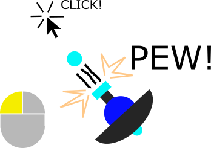

# Welcome!
Polygon planet is a top down, 2-D bullet hell game built using the Unity game engine

## Contents

This README covers the absolute basics of the video game's mechanics and how to get started constributing to the project.  After reading this, if you're interested in contributing to this project, you should familiarize yourself with this project's [wiki](https://github.com/BenjiBoy926/Polygon-Planet/wiki)

1. Basic mechanics
	1. [Player movement](#PlayerMovement)
	2. [Player gun](#PlayerGun)
	3. [Player shield](#PlayerShield)
2. Contributing

## PlayerMovement

Player movement is lightweight and snappy, allowing movement in all four directions.  Move using ASDF of arrow keys

## PlayerGun

The Player aims towards the mouse.  Repeatedly click to shoot.

Hold down the left mouse button to charge up an attack, and release when charged to launch a powerful charged shot!

## PlayerShield

The Player's shield faces *opposite* the mouse pointer.  The shield *automatically* blocks attacks

---

